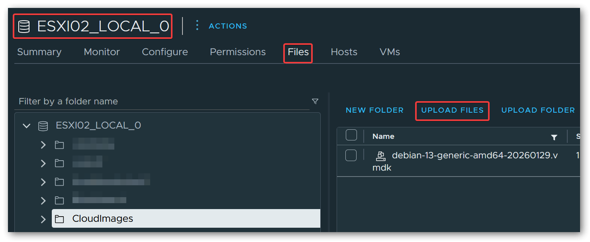
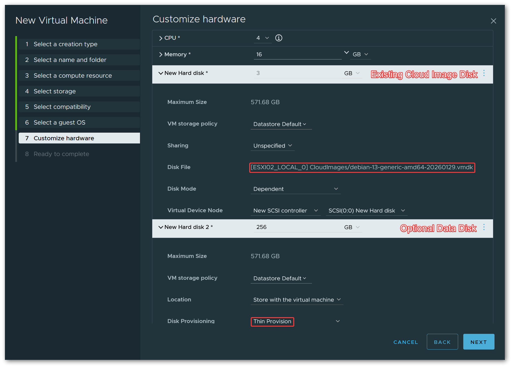
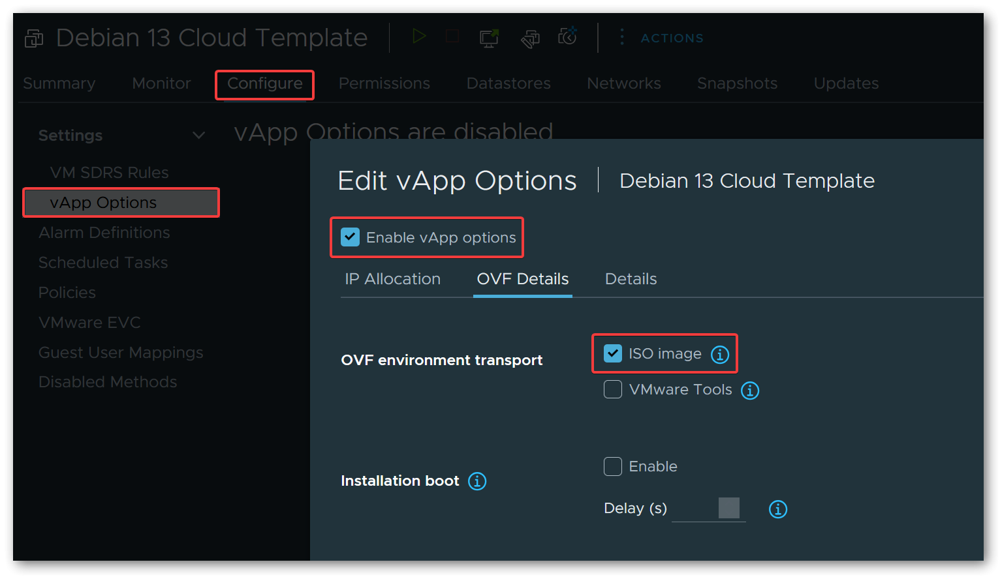

Deploying virtual machines from scratch by running through the OS installer each time is tedious, especially when you need to spin up multiple VMs with a similar base configuration. Cloud images solve this problem by providing pre-built, minimal OS images that are designed to be customized at first boot using [Cloud-Init](https://cloud-init.io/).

In this post, I describe the full workflow of preparing a Debian 13 (Trixie) cloud image for use on VMware ESXi: downloading the image, converting it to a format ESXi understands, and creating a reusable VM template with vApp properties that feed `user-data` and `network-config` into Cloud-Init.

## 1 Downloading the Cloud Image

Debian provides official cloud images for various platforms on [cloud.debian.org](https://cloud.debian.org/images/cloud/trixie/latest/). The images are available in multiple formats, but for our purposes we need the `qcow2` format, which we will later convert to VMDK.

There are two main image variants to choose from:

- **`generic`**: Ships with a broader set of kernel modules and drivers, including support for various storage controllers, network adapters, and other hardware typically found in virtualized environments. This is the recommended variant for ESXi, as the hypervisor exposes diverse virtual hardware to the guest.
- **`genericcloud`**: A stripped-down variant with a smaller kernel optimized for cloud and KVM environments. It contains fewer drivers and is primarily intended for use on public cloud providers (AWS, GCP, etc.) or pure KVM/QEMU setups.

For our use case on ESXi, the `generic` variant for `amd64` is the right choice:

```shell
wget https://cloud.debian.org/images/cloud/trixie/latest/debian-13-generic-amd64.qcow2
```

Alternatively, if you prefer using backport packages:

```shell
wget https://cloud.debian.org/images/cloud/trixie-backports/latest/debian-13-backports-generic-amd64.qcow2
```

## 2 Converting the Image

ESXi cannot use `qcow2` images directly. The conversion is a two-step process: first we convert the image to VMDK format using `qemu-img` on a Linux machine, then we convert it to ESXi's native VMDK format using `vmkfstools` on the ESXi host itself.

### 2.1 Converting QCOW2 to VMDK

The `qemu-img` tool is part of the `qemu-utils` package and can be installed on any existing Debian (or Ubuntu) machine:

```shell
sudo apt install qemu-utils
```

The initial conversion from `qcow2` to `vmdk` is performed using this command:

```shell
qemu-img \
  convert \
  -f qcow2 \
  -O vmdk \
  -o subformat=streamOptimized \
  debian-13-generic-amd64.qcow2 \
  debian-13-generic-amd64.vmdk
```


The `streamOptimized` subformat produces a single compressed VMDK file, which is ideal for uploading and later conversion on the ESXi host.


### 2.2 Uploading the VMDK to ESXi

The intermediate VMDK file needs to be uploaded to an ESXi datastore before it can be converted to the final format.

**Via the vSphere UI:**

Navigate to `Storage` → select the target datastore → click the `Upload` button and select the `.vmdk` file.



**Via SCP:**

```shell
scp debian-13-generic-amd64.vmdk root@esxi02:/vmfs/volumes/<datastore-name>/
```

### 2.3 Converting to Final VMDK Format

The VMDK produced by `qemu-img` is not in ESXi's native disk format and cannot be used directly. We need to convert it one more time using `vmkfstools` on the ESXi host via SSH.

**Thin provisioned** (recommended for templates - the disk file starts small and grows on demand):

```shell
vmkfstools \
  -i /vmfs/volumes/<datastore>/debian-13-generic-amd64.vmdk \
  -d thin \
  /vmfs/volumes/<datastore>/debian-13-generic-amd64-final.vmdk
```

**Thick provisioned (eager zeroed)** (pre-allocates the full disk space, potentially better I/O performance):

```shell
vmkfstools \
  -i /vmfs/volumes/<datastore>/debian-13-generic-amd64.vmdk \
  -d eagerzeroedthick \
  /vmfs/volumes/<datastore>/debian-13-generic-amd64-final.vmdk
```


After the conversion completes, you can delete the intermediate VMDK file to free up space on the datastore.


## 3 Creating the VM Template

### 3.1 Creating the Virtual Machine

Create a new virtual machine in the vSphere UI and configure the basic settings: name, guest OS type (`Debian GNU/Linux 13 (64-bit)`), CPU, and RAM.


If you are running an older version of ESXi that does not list Debian 13 in the guest OS dropdown, selecting `Debian GNU/Linux 12 (64-bit)` works just as well.


On the hardware customization page, **remove the default hard disk** that the wizard creates automatically. Instead, add an `Existing Hard Disk` and browse to the final VMDK on the datastore (`debian-13-generic-amd64-final.vmdk`).

Optionally, **add a second thin-provisioned hard disk** that will serve as the default data disk for VMs cloned from this template. The size can be adjusted per clone later, but a reasonable default (e.g. 256 GiB) is a good starting point.


Adding a dedicated data disk to the template allows every cloned VM to have a separate data partition. Cloud-Init can automatically partition, format, and mount this disk on first boot, as demonstrated in the [example configuration](#4-example-cloud-init-configuration) below.




For the SCSI controller type, `VMware Paravirtual` (pvscsi) is recommended for best performance.

### 3.2 Configuring vApp Options

This is the key step that enables Cloud-Init integration. vApp properties are key-value pairs attached to a VM that can be made available to the guest operating system. When using the **ISO image** transport, ESXi generates a small ISO image containing the OVF environment XML and attaches it as a virtual CD-ROM drive to the VM at boot time. Cloud-Init's OVF datasource automatically detects this ISO, reads the properties, and applies the configuration.

This approach does not require VMware Tools (or `open-vm-tools`) to be pre-installed in the cloud image, which is important because the Debian cloud image does not ship with it.

To set this up, edit the VM settings and navigate to `vApp Options`. Enable vApp options, then under `OVF Details`, select **ISO image** as the OVF environment transport.



Next, add two custom `string` properties:

**1. `user-data`**

| Field | Value |
|-------|-------|
| Key ID | `user-data` |
| Category | `Cloud-Init` |
| Label | `User-Data` |

**2. `network-config`**

| Field | Value |
|-------|-------|
| Key ID | `network-config` |
| Category | `Cloud-Init` |
| Label | `Network-Config` |


When a VM with these properties boots, ESXi generates the ISO containing the OVF environment XML and attaches it to the VM. Cloud-Init's OVF datasource mounts this ISO, extracts the `user-data` and `network-config` property values, and uses them to configure the system - setting the hostname, creating users, configuring SSH keys, setting up networking, installing packages, running commands, and more.


The values for both `user-data` and `network-config` must be **Base64 encoded**. When cloning a VM from this template, encode your cloud-config YAML files to Base64 and paste the resulting strings into the respective vApp property fields.


For a complete example covering both `user-data` and `network-config`, see [Example Cloud-Init Configuration](#4-example-cloud-init-configuration) below.


To encode a YAML file to Base64 on Linux: `base64 -w0 < user-data.yaml`


### 3.3 Converting to Template

With the VM fully configured, right-click it in the vSphere UI and select `Template` → `Convert to Template`. The VM is now a template and can no longer be powered on directly.

To deploy a new VM, clone the template and customize the vApp properties (`user-data` and `network-config`) with the desired Base64-encoded configuration for each clone. On first boot, Cloud-Init will pick up the configuration and set up the VM accordingly.

## 4 Example Cloud-Init Configuration

The following example provides a `user-data` configuration for VMs that host services such as Docker stacks, web servers, or other applications. Password-based SSH authentication is disabled entirely, and all login is restricted to SSH key authentication. Two user accounts are created: one for interactive administration and one dedicated to Ansible (for automation). On the network side, UFW is installed and configured to deny all incoming traffic by default, with only SSH explicitly allowed.

The configuration also sets up an optional data disk mounted at `/srv`.

The [Filesystem Hierarchy Standard](https://refspecs.linuxfoundation.org/FHS_3.0/fhs/ch03s17.html) recommends `/srv` as the location for site-specific data served by the system, making it a natural choice for Docker volumes, Compose stacks, application data, or any other service-related files. Cloud-Init partitions and formats the second hard disk (`/dev/sdb`) as `ext4` and mounts it at `/srv` automatically on first boot. Because the mount uses the `nofail` option, VMs cloned from the template work perfectly fine even without the second disk attached. The system simply boots without the `/srv` mount, which makes the template flexible enough for both full service VMs with a dedicated data disk and lightweight utility VMs that do not need one.

### 4.1 User-Data

```yaml
#cloud-config

hostname: changeme
fqdn: changeme.domain.com
prefer_fqdn_over_hostname: false

keyboard:
  layout: de
timezone: Europe/Berlin

ssh_pwauth: false
users:
  - name: administrator
    ssh_authorized_keys:
      - ssh-ed25519 AAAA... your-key
    shell: /bin/bash
    sudo: ALL=(ALL) NOPASSWD:ALL
    groups:
      - users
      - sudo
    passwd: <output from mkpasswd --method=SHA-512 --rounds=4096>
    lock_passwd: false
    chpasswd: { expire: false }
  - name: ansible
    ssh_authorized_keys:
      - ssh-ed25519 AAAA... your-key
    shell: /bin/bash
    sudo: ALL=(ALL) NOPASSWD:ALL
    groups:
      - users
      - sudo
    lock_passwd: true

disk_setup:
  /dev/sdb:
    table_type: gpt
    layout: true
    overwrite: false

fs_setup:
  - device: /dev/sdb1
    label: 'srv_data'
    partition: any
    filesystem: ext4

mounts:
  - [ '/dev/sdb1', '/srv', 'ext4', 'defaults,discard,nofail,rw', '0', '2' ]

growpart:
  mode: auto
  devices: ['/', '/dev/sdb1']
  ignore_growroot_disabled: false

packages:
  - ufw
  - lsb-release
  - open-vm-tools
  - curl
  - apt-transport-https
  - ca-certificates

package_update: true
package_upgrade: true
package_reboot_if_required: true

ntp:
  enabled: true

power_state:
  timeout: 600
  mode: reboot

runcmd:
  # Set permissions for '/srv'
  - chmod 0750 /srv || true
  # Remove MOTD
  - rm -f /etc/motd
  # Configure UFW
  - ufw default deny incoming
  - ufw default allow outgoing
  - ufw allow ssh
  - ufw --force enable
```

**Identity and Locale:**

The `hostname`, `fqdn`, and `prefer_fqdn_over_hostname` modules set the VM's hostname and fully qualified domain name. With `prefer_fqdn_over_hostname` set to `false`, short hostnames are used in prompts and logs while the FQDN is still properly configured in `/etc/hosts`.

The `keyboard` and `timezone` modules configure the keyboard layout and system timezone early during first boot.

**User Accounts and SSH:**

Setting `ssh_pwauth` to `false` disables password-based SSH authentication entirely, enforcing key-based access only.

The `users` block creates two accounts: `administrator` for interactive use and `ansible` for automation. Both are configured with passwordless sudo and SSH key authentication.

The `administrator` account has `lock_passwd: false` with a hashed password, which allows local console login via the vSphere web client. This is useful for troubleshooting and maintenance when the VM has no network connectivity - you can still access the system through the vSphere console without relying on SSH. The password must be generated using `mkpasswd --method=SHA-512 --rounds=4096` to produce the required hash format. Since `ssh_pwauth` is set to `false` globally, password-based SSH login remains disabled; only local console access accepts the password.

The `ansible` account has `lock_passwd: true` because it is only used for automated SSH access and should never be logged into interactively.

**Data Disk:**

The `disk_setup`, `fs_setup`, and `mounts` modules handle the second hard disk (`/dev/sdb`).

Cloud-Init creates a GPT partition table, formats the first partition as `ext4` with the label `srv_data`, and mounts it at `/srv`. The mount options include `nofail` to prevent boot failures if the disk is absent.

The `growpart` module automatically expands partitions to fill the available disk space on both the root partition and `/dev/sdb1`. This is particularly useful when you resize either VMDK beyond the original size in vSphere (not limited to the initial boot).

**Packages and Updates:**

The `packages` module installs additional software including `ufw` (firewall), `open-vm-tools` (VMware guest agent for vSphere integration), and common utilities.

The `package_update` and `package_upgrade` options ensure the package index is refreshed and all installed packages are upgraded to their latest versions. If any upgrade requires a reboot (e.g. a kernel update), `package_reboot_if_required` triggers one automatically.

**System Services:**

The `ntp` module enables NTP time synchronization to keep the system clock accurate.

**Post-Setup Commands:**

The `runcmd` module executes shell commands after all other modules have run. In this configuration, it restricts permissions on `/srv` to `0750`, removes the default MOTD file, and configures UFW to deny all incoming traffic by default while explicitly allowing SSH.

### 4.2 Network-Config

The following is an example `network-config` using the Networking v2 format:

```yaml
instance-id: changeme
local-hostname: changeme
hostname: changeme.domain.com
network:
  version: 2
  ethernets:
    id0:
      match:
        name: ens*
      addresses:
        - 192.168.100.32/24
      dhcp4: false
      routes:
        - to: default
          via: 192.168.100.1
      mtu: 9000
      nameservers:
        search: [domain.com]
        addresses:
          - 192.168.100.2
```

The `instance-id`, `local-hostname`, and `hostname` fields at the top identify the instance and should match the values in `user-data`.

Under the `network` block, a static IPv4 address is assigned with DHCP disabled. The `routes` list defines the default route, and `mtu: 9000` enables jumbo frames (useful if your physical network supports it for better throughput). The `nameservers` block configures DNS resolution with a search domain and a local DNS server address.


The configuration uses `match: name: ens*` instead of a specific interface name like `ens33` or `ens192`. This is necessary because VMware virtual network adapters receive their names based on the virtual PCIe slot position assigned by ESXi. Linux's predictable network interface naming scheme encodes this slot index into the interface name - an adapter at one PCI slot might become `ens192`, while the same adapter at a different slot becomes `ens224`.

When you clone a VM from a template, the PCIe slot assignment can shift depending on device order and other factors in the VM configuration. A hardcoded interface name would fail to match, leaving the network unconfigured. The wildcard pattern makes the configuration hardware-agnostic: it matches any `ens*` interface, so the same template works reliably across all clones regardless of their specific PCIe slot assignments.



The `ens*` pattern matches all interfaces with that prefix. If your VM has multiple network adapters, all of them will match this rule and receive the same configuration - which is almost certainly not what you want.

For VMs with a single network adapter, this is not a problem. However, if you plan to add additional adapters later, you should update the netplan configuration in `/etc/netplan/` after the first boot to use MAC address matching instead:

```yaml
ethernets:
  primary:
    match:
      macaddress: "00:50:56:xx:xx:xx"
    addresses:
      - 192.168.100.32/24
    # ... rest of config
```

Make this change before adding new network adapters in the VM configuration.


## 5 Conclusion

With this setup, deploying a new Debian VM is reduced to cloning a template and pasting two Base64-encoded YAML strings. There is no need to run through the OS installer, manually configure networking, or set up user accounts. Cloud-Init takes care of all of it on first boot.

The same approach works for other distributions that provide cloud images with Cloud-Init support, such as Ubuntu or Rocky Linux. The image conversion steps remain identical; only the download URL and possibly some cloud-config details change.

For those looking to take this further, the entire deployment workflow - cloning from the template, setting vApp properties, and powering on the VM - can be fully automated using [Terraform](https://www.terraform.io/) with the [vSphere provider](https://registry.terraform.io/providers/vmware/vsphere/latest/docs). That is out of scope for this post, but it might be the topic of a follow-up article.
