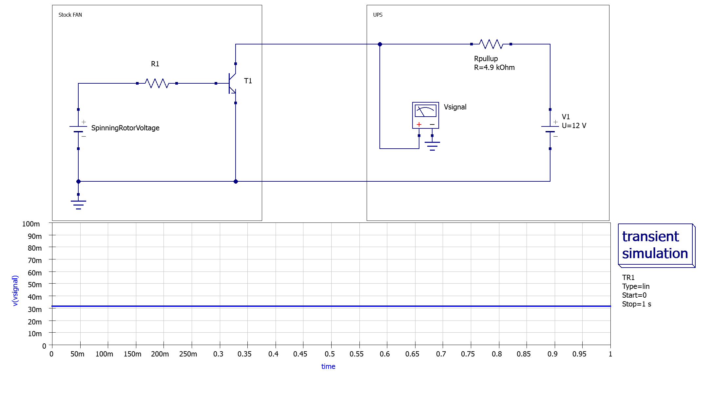
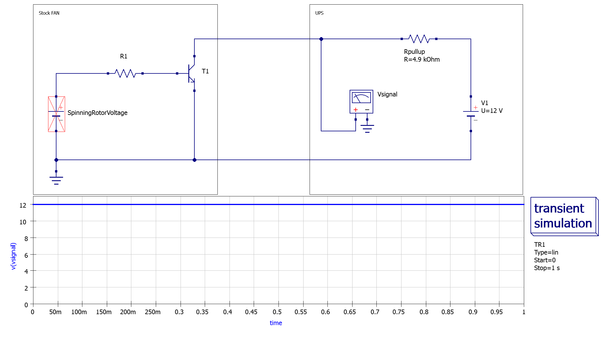
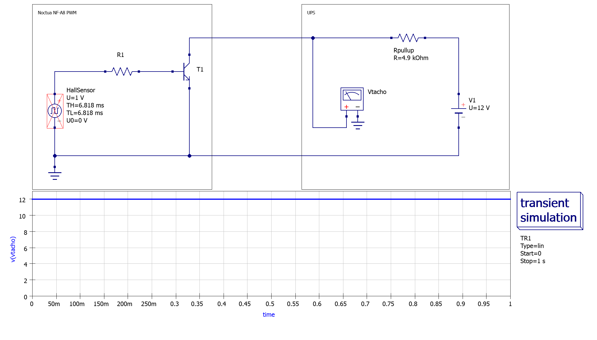
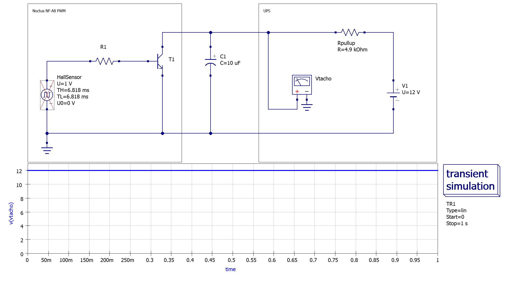

I recently decided to replace my existing APC UPS devices with the robust `Eaton 9PX 1500VA` UPS. However, there was a catch - the standard fan on the Eaton UPS was too loud for my home lab environment. In this article, I share my experience of replacing the stock fan with a quieter Noctua fan and the modifications that were required to make it work smoothly.


Replacing the standard fan with a different model may cause unexpected long term problems and will also void the warranty. Any modification is at your own risk.


## 1 Motivation

The decision to replace my existing APC UPS devices was driven by several factors. The batteries in both my APC `SMT1500RMI2UC` and `SMT750RMI2UC` had reached the end of their life and replacing them would not have been cheap. In addition, APC's recent questionable business decisions, such as requiring mandatory subscriptions to use their automatic shutdown tool `PowerChute Network Shutdown` and to receive software updates for the network card, made their UPS devices less attractive for homelab needs. 

In contrast, Eaton offers perpetual licenses for its corresponding shutdown tool `Intelligent Power Manager`, which ensures long-term usability without ongoing subscription costs. Firmware updates for the network card are free.

## 2 Disassembling the UPS


Before opening the UPS, it is essential to disconnect the AC cable and the battery first, as the voltage inside the UPS can be extremely dangerous.


The quick connector for the battery is located right behind the front panel.

To open the UPS, 3x T10 screws had to be unscrewed before the top cover could be pushed backwards.

Inside the UPS was a plastic air baffle, which also had to be removed first.

Finally, we can take a look at the fan connector, which turns out to be a standard 3-pin `JST XHP 2.54mm` connector.

## 3 Fan Comparison

### Stock Fan

There is a 60mm fan in the front of the device and an 80mm fan at the back. At the moment I'm concentrating on the latter as the 60mm fan is already pretty quiet.

After doing a little research on the fan, I found out that is equipped with a locked rotor sensor and the pinout is as follows:

-  +12V
-  Locked Rotor Signal
-  Ground (GND)

This type of locked rotor sensor is usually realized via either an open collector or an open drain circuit. In our case, we are dealing with an [open collector](https://www.electronics-tutorials.ws/transistor/open-collector-outputs.html) circuit, which outputs a logical "high" signal when the fan is stalled. In normal operation, the signal is pulled down to a logical "low" value.

### Replacement Fan

As a replacement for the standard fan, I decided on the `Noctua NF-A8 PWM` (the non-PWM variant also works). This fan is not quite as powerful as the original fan, but it is significantly quieter - which is exactly what we want. In terms of performance, the Noctua fan can build up less static pressure, which can be a problem in tight, closed server racks. For my home lab, however, this is an absolutely acceptable trade-off.

The pinouts of the Noctua PWM fan are as follows:

-  PWM Signal (+5V)
-  RPM Speed Signal
-  +12V
-  Ground (GND)

If you are using the non PWM variant of the same fan, the pinouts are as follows:

-  /  RPM Speed Signal
-  +12V
-  Ground (GND)

### Datasheet Comparison

|                        | Stock Fan           | Noctua Fan
| ---------------------- | ------------------- | ----------------------- |
| **Model**              | NMB 08025SA-12P-AL  | Noctua NF-A8 PWM        |
| **Rotational speed**   | 3500 RPM            | 2200 RPM                |
| **Operating voltage**  | 12V                 | 12V                     |
| **Max. input current** | 0.30A               | 0.08A                   |
| **Airflow**            | 79.7 m³/h           | 55.5 m³/h               |
| **Static pressure**    | 8.36 mm H₂O         | 2.37 mm H₂O             |
| **Acoustical noise**   | 34.0 dB(A)          | 17.7 dB(A)              |
| **Signal wire**        | Locked Rotor Sensor | Tachometer Signal (RPM) |

## 4 Simulating the Circuit

My friend Felix Schneider managed to analyze the relevant parts of the PCB and also instructed me to carry out some measurements. This enabled us to determine the value of the internal pull-up resistor at `4.9 kΩ` and the logical "high" voltage at `12V`.

### Stock Fan

During normal operation, transistor `T1` is permeable, which means that the voltage provided by the UPS is pulled to ground and thus generates a logical "low" signal.

When the rotor is blocked, the transistor `T1` closes and the voltage on the signal line is pulled up to 12V via the internal pull-up resistor, thus generating a logical "high" signal. The UPS reacts to this by displaying a fan error.

### Replacement Fan

As described in the [specification](https://noctua.at/pub/media/wysiwyg/Noctua_PWM_specifications_white_paper.pdf), the Noctua fan outputs a uniform square wave voltage on the signal line depending on the position of the rotor. A Hall sensor is used internally to control the transistor `T1`. In our model of the circuit, we use a square-wave voltage generator to simulate the Hall sensor, although in reality it generates more of a sinusoidal signal.


The circuit simulator software I use does not allow me to set the pulses per second/minute. The absolute duration of the "high" pulse (`TH`) and the absolute duration of the "low" pulse (`TL`) must be specified instead.

The calculation is made as follows:

$ TH/TL = \frac{1}{2} \cdot \frac{1000}{\frac{RPM}{60} \cdot Revolutions} = \frac{15000}{RPM} ms $


")

During normal operation, we can see the uniform square wave voltage alternating between logical "high" and logical "low" as expected.

When the rotor is blocked, the Noctua fan always generates a permanent "high" signal, analogous to the stock fan.

### Interim Conclusion

Based on these observations, this unfortunately means that we cannot simply replace the existing fan with the Noctua model, as the latter outputs a tachometer signal (RPM). 

The UPS misinterprets the logical "high" pulses of the RPM signal as a blocked rotor signal (as a reminder: logical "low" = normal operation, logical "high" = blocked fan) and immediately displays a fan error. According to my tests, the UPS has a certain tolerance and only triggers the fan error when the signal voltage exceeds a threshold value.

### Modifying the Circuit

 To solve our problem, we need to ensure that the voltage always remains at a low level during normal operation. To achieve this, we build a low-pass filter by wiring a sufficiently large capacitor (`10 uF`) between the RPM signal cable and ground.

 with capacitor")

As we can see, the voltage now reaches a much lower peak value. In theory, we could set the capacitance of the capacitor even higher to be on the safe side. According to my tests, however, this is not necessary.


The effective resulting "high" voltage also depends on the speed of the fan. The UPS controls the stock fan via the input voltage to values between 100% and 80%. Projected onto the Noctua fan, this corresponds approximately to speeds between 2200 RPM and 1780 RPM.


In case of a locked rotor, the circuit still generates a permanent "high" signal.


The Noctua fan [specification](https://noctua.at/pub/media/wysiwyg/Noctua_PWM_specifications_white_paper.pdf) states that the signal is either permanently "high" or permanently "low" in the event of a blocked fan - depending on the rotor position.

Fortunately, I have not observed this behavior with the NF-A8 PWM. In all my measurements, the signal always jumped to logical "high" in every rotor position. If this were not the case, we would have a problem, as there would be no way for the UPS to detect a blocked fan condition (without us building a much more complex circuit).

I have also contacted Noctua and they have confirmed that the NF-A8 PWM does indeed always output a “high” signal when the rotor is blocked. However, this can vary from model to model.


## 5 Building an Adapter

The plan is to make a simple adapter that allows to connect any RPM fan with 3/4-pin Molex connector to the JST XHP connector of the UPS while converting the RPM signal to the required locked rotor sensor voltage.

For the adapter, I cut open the extension cable supplied with the Noctua NF-A8 and connected it to a `2.54mm JST-XHP` connector. I also connected the "signal" and "GND" pins via a `10 uF 50V electrolytic capacitor` (taking care to connect the negative lead of the electrolytic capacitor to "GND").

This should ensure that the RPM signal is converted into the required fan stall signal and allows us to swap the stock fan with the Noctua one while fan error detection remains fully functional.

The resulting adapter looks like this:

At the end, I also insulated the wires of the capacitor before installing the adapter in the UPS.

## 6 Testing

After replacing the fan using the adapter, I ran some tests to verify the correct functionality.

The result was very satisfactory: the new fan runs perfectly in both AC and battery mode and, as expected, is significantly quieter than the stock model.

Stopping the fan manually with a finger triggers a fan error after a few seconds, as desired.
