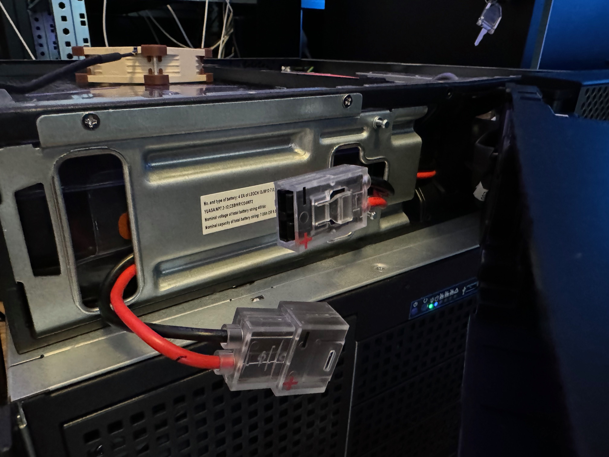
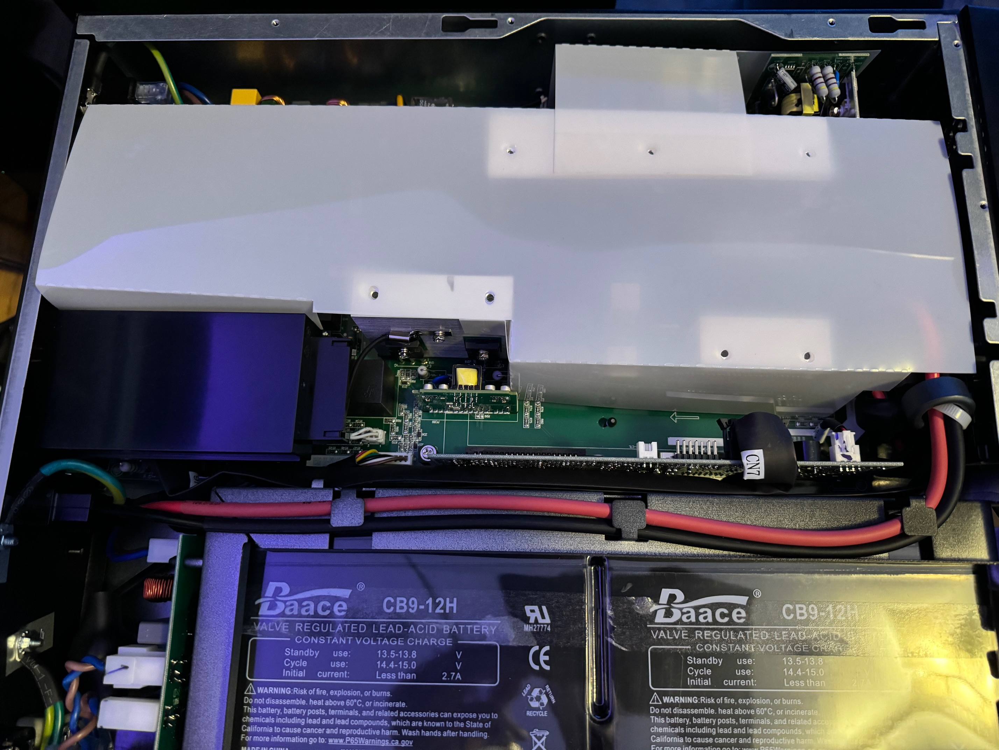
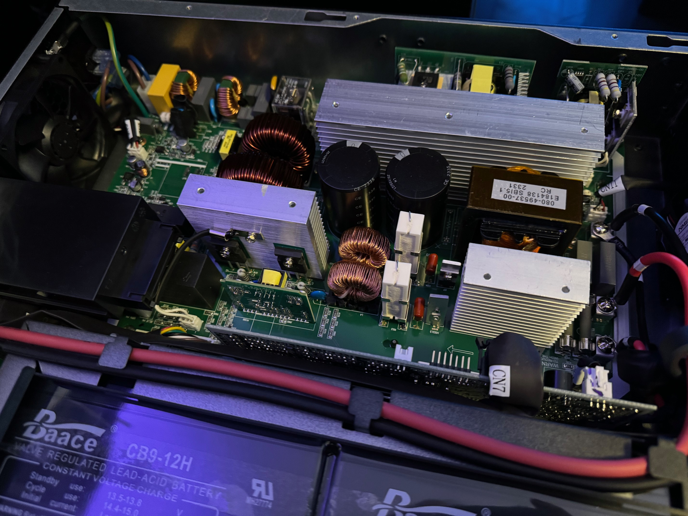
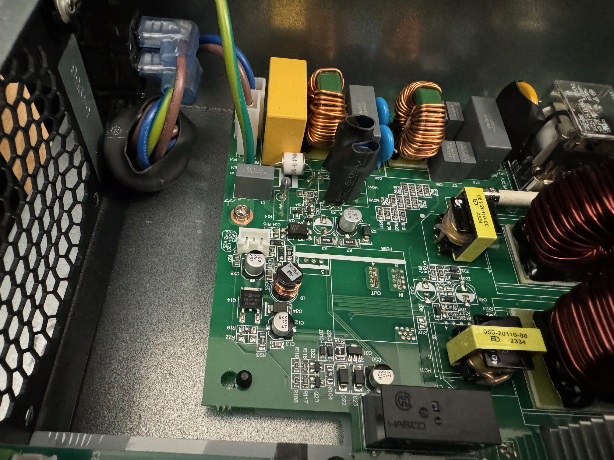
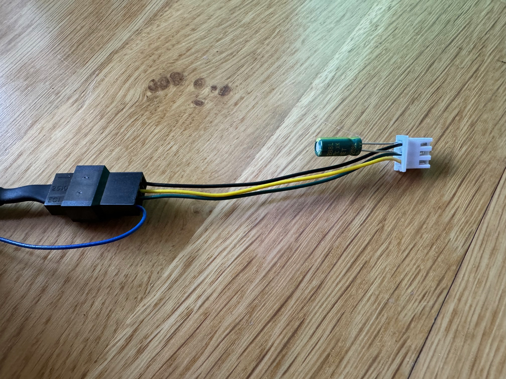
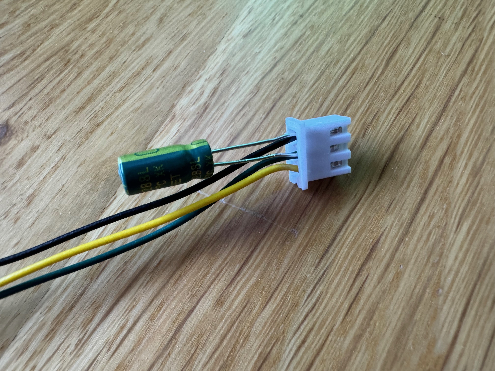

I recently decided to replace my existing APC UPS devices with the robust `Eaton 9PX 1500VA` UPS. However, there was a catch - the standard fan on the Eaton UPS was tooloud for my home lab environment. In this article, I share my experience of replacing the stock fan with a quieter Noctua fan and the modifications that were required to make it work smoothly.

## 1 Motivation

The decision to replace my existing APC UPS devices was driven by several factors. The batteries in both my APC `SMT1500RMI2UC` and `SMT750RMI2UC` had reached the end of their life and replacing them would not have been cheap. In addition, APC's recent questionable business decisions, such as requiring mandatory subscriptions to use their automatic shutdown tool `PowerChute Network Shutdown` and to receive software updates for the network card, made their UPS devices less attractive for homelab needs. 

In contrast, Eaton offers perpetual licenses for its corresponding shutdown tool `Intelligent Power Manager`, which ensures long-term usability without ongoing subscription costs.

## 2 Disassembling the UPS


Before opening the UPS, it is essential to disconnect the AC cable and the battery first, as the voltage inside the UPS can be extremely dangerous.


The quick connector for the battery is located right behind the front panel.

To open the UPS, 4x T10 screws had to be unscrewed before the top cover could be pushed backwards.

Inside the UPS was a plastic air baffle, which also had to be removed first.

Finally, we can take a look at the fan connector, which turns out to be a standard 3-pin `JST XHP 2.54mm` connector.

## 3 Technical Specifications

### Stock Fans

After doing a little research on the stock fans, I found that they were equipped with locked rotor sensors that produce `15 mV` (for the smaller 60mm fan) and `40 mV` (for the larger 80mm fan) on the signal line when running, while delivering zero to slightly negative voltage when not running.

The pinouts of the stock fans are as follows:

-  +12V
-  Fan Stall Signal
-  Ground (GND)

### Noctua PWM Fan

The pinouts of the Noctua PWM fan are as follows:

-  PWM Signal (+5V)
-  RPM Speed Signal
-  +12V
-  Ground (GND)

### Noctua non PWM Fan

If you are using a non PWM fan from Noctua, the pinouts are as follows:

-  /  RPM Speed Signal
-  +12V
-  Ground (GND)

### Developing a plan

Unfortunately, this means that we cannot simply replace the existing fan with the Noctua model, as the latter emits a tachometer (RPM) signal. The UPS cannot correctly interpret the RPM signal from the Noctua fan and therefore immediately displays a fan error.

Equipped with this knowledge, I proceeded to replace the 80mm stock fan with a `Noctua NF-A8 PWM`. I'm keeping the original 60 mm fan for the time being, as it's already pretty quiet.


Replacing the standard fan with a different model may cause unexpected long term problems and will also void the warranty. Any modification is at your own risk.


My plan is to make a simple adapter that allows to connect any RPM fan with 3/4-pin Molex connector to the JST XHP connector of the UPS while converting the RPM signal to the required locked rotor sensor voltage.

## 4 Building the Adapter

For the adapter, I cut open the extension cable supplied with the Noctua NF-A8 and connected it to a `2.54mm JST-XHP` connector. I also connected the "fan stall" and "GND" pins via a `10 uF 50V electrolytic capacitor` (taking care to connect the negative lead of the electrolytic capacitor to "GND").

This should ensure that the RPM signal is converted into the required fan stall signal and allows us to swap the stock fan with the Noctua one while fan error detection functionality remains fully functional.

The resulting adapter looks like this:

At the end, I also insulated the wires of the capacitor before installing the adapter in the UPS.

## 5 Testing

After replacing the fan using the adapter, I ran some tests to verify the correct functionality.

The result was very satisfactory: the new fan runs perfectly in both AC and battery mode and, as expected, is significantly quieter than the stock model.

Stopping the fan manually with a finger triggers a fan error after a few seconds, as desired.
