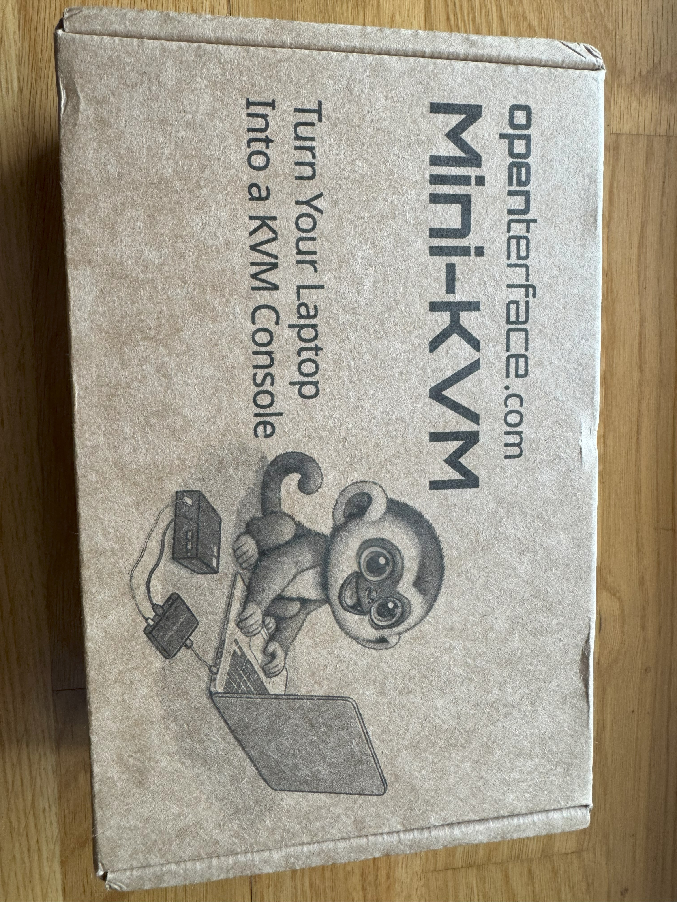

A few weeks ago I applied for a place as a beta tester for `Openterface Mini-KVM`, an open-source KVM-over-USB solution, and was accepted shortly afterwards.

Now that the package has found its way from China into my hands without any problems, it's time to start testing.


The following article expresses solely my personal opinion. I have not been paid for this article, nor have I been influenced in any other way.


## 1 About the Product

The `Openterface Mini-KVM` is an open-source KVM-over-USB solution that allows you to use your own laptop to display and control headless devices directly through a USB and HDMI connection. It captures video via HDMI and simulates keyboard and mouse inputs.

The target group is tech enthusiasts and IT professionals who often work with headless devices. Openterface is intended to simplify troubleshooting and also facilitate the initial setup of permanent KVM solutions (e.g. Intel AMT/vPro). However, Openterface itself can also be implemented as a permanent KVM solution - for example in environments that do not offer a stable network connection.

### 1.1 Open Source

One of the most interesting aspects of this product for me is that both the software ([QT App](https://github.com/TechxArtisanStudio/Openterface_QT), [MacOS App](https://github.com/TechxArtisanStudio/Openterface_MacOS)) and the [hardware](https://github.com/TechxArtisanStudio/Openterface_Mini-KVM_Hardware) (3D models, BOM, schematics, etc.) are completely open source.

### 1.2 Specifications

#### 1.2.1 Interfaces

- ① **Host USB-C Port**: As a USB device port, connecting to the host device for data transfer via built-in USB hub
- ② **Target USB-C Port**: As a SUB device port, connecting to the target device for emulating keyboard and mouse HID output via build-in USB hub
- ③ **HDMI Input Port**: HDMI source input from the target device
- ④ **Switchable USB-A 2.0 Port**: As a USB host port, utilized by either the host device or the target device at any given time, but not simultaneously (e.g. to share a USB drive)
- ⑤ **Toggle Switch**: For toggling the connection of the USB-A 2.0 port between the host and the target device

#### 1.2.2 Power

- The KVM is USB-C powered. No external power supply required.

#### 1.2.3 Video

- Max video input: Up to 3840x2160@30Hz, via HDMI
- Max video output: Up to 1920x1080@30Hz
- Video compression methods: YUV, MJPEG
- Latency: Under 140 milliseconds

#### 1.2.4 Audio

- Audio Capture Mode: HDMI embedded audio


This function seems to be available only in the macOS application at the moment.


### 1.3 Advanced Features

In addition to the basic features such as video/audio transmission and control of the target device, other advanced features are also advertised.

#### 1.3.1 Text Transfer

The text transfer functionality allows you to send text from the host computer to the target device. This feature emulates typing behaviour to reproduce text content on the target computer.


This function seems to be available only in the macOS application at the moment.


## 2 Unboxing

In addition to the KVM itself, the toolbox contains several cables and adapters:

- A 150cm USB-C cable, which is intended for connecting the host to the KVM
- A 30cm USB-C to USB-A/USB-C cable, which is intended for connecting the target to the KVM
- An active VGA + 3.5 jack plug + USB-A to HDMI converter cable
- An HDMI cable

## 3 Preparing the Host

For my test, I installed the Openterface QT application on a Windows 11 system. 

You can tell immediately that the software is still a beta version. On my 4K screen scaled to 150%, the text appears slightly distorted. Many applications based on QT (including the popular VLC media player, for example) are suffering from this problem.

Furthermore, without connected hardware, the menu entries are either not functional or even cause the application to crash (File -> Change Settings).

## 4 Testing

### 4.1 Windows 11 Laptop

As the target system for the first test, I selected a laptop with Windows 11 as the operating system. Once all the cables were plugged in, the Openterface application immediately displayed an image and the control of the target computer also worked without delay.

During the short test session, however, I noticed a few things, at least two of which I found annoying.

#### 4.1.1 Aspect Ratio Problem

My laptop uses a `16:10` format (3200x2000), whereas the Openterface application uses `16:9` (maximum 1920x1080). This leads to a black strip appearing on the left and right of the screen and also causes the local and remote mouse pointers not to be congruent. The application also locks the aspect ratio, which prevents the user from circumventing this problem by changing the window size.

While the black stripes are not particularly distracting, the incongruent mouse pointers are definitely a major problem, which in my opinion should be addressed with high priority.

#### 4.1.2 Keyboad Layout Problem

The second problem is related to the keyboard. The QT application does not automatically recognize that my global keyboard layout in Windows is set to `DE`. Also, there is currently no way to manually set a layout other than `US`.

It is also worth mentioning that keystrokes of special keys, such as the `WIN` or `ALT` key, are currently not forwarded correctly to the target system, but are instead handled by the window of the QT application or the host system.

### 4.2 Supermicro Server

As a second test system, I decided to use a Supermicro server, which I connected via the included active VGA to HDMI adapter.

This time the aspect ratio is right and the system can also be controlled perfectly in all other respects.

## 5 Conclusion

All in all, the Openterface KVM is an extremely useful tool that I will certainly be using a lot in the future.

The hardware is more than solid and the toolbox also contains all the accessories you need.

If you look at the software side, you can clearly see that it is still in the beta phase. The macOS application (I plan to test this as well when I have some spare time) seems to be generally better polished than the QT application, both in terms of supported features and usability. I will definitely be keeping an eye on further developments and may even actively support them.

Another useful feature that some KVMs support, but which I currently miss in Openterface, is the ability to mount images on the target computer from the host computer. I personally like to use this functionality to install the operating system on headless hardware.
