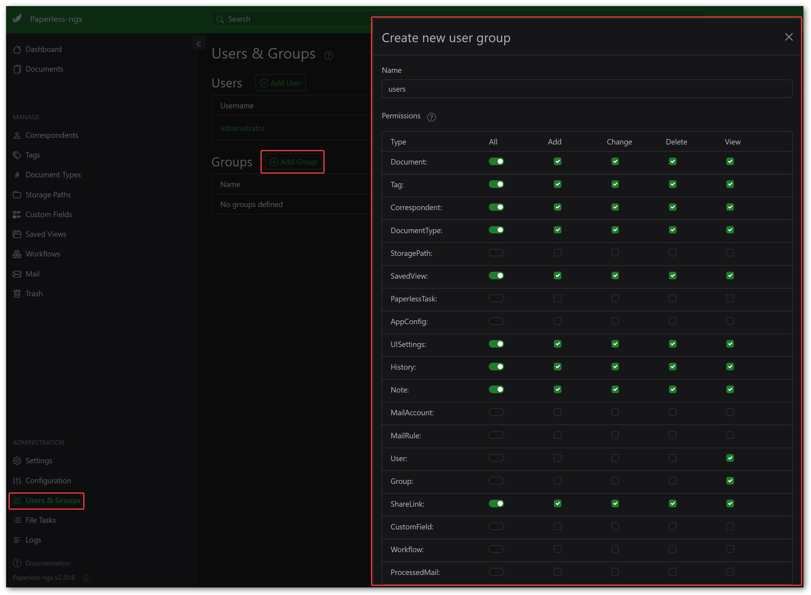
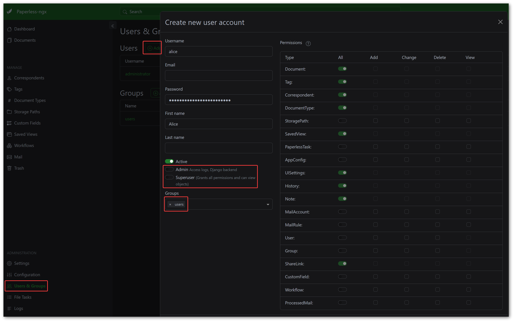
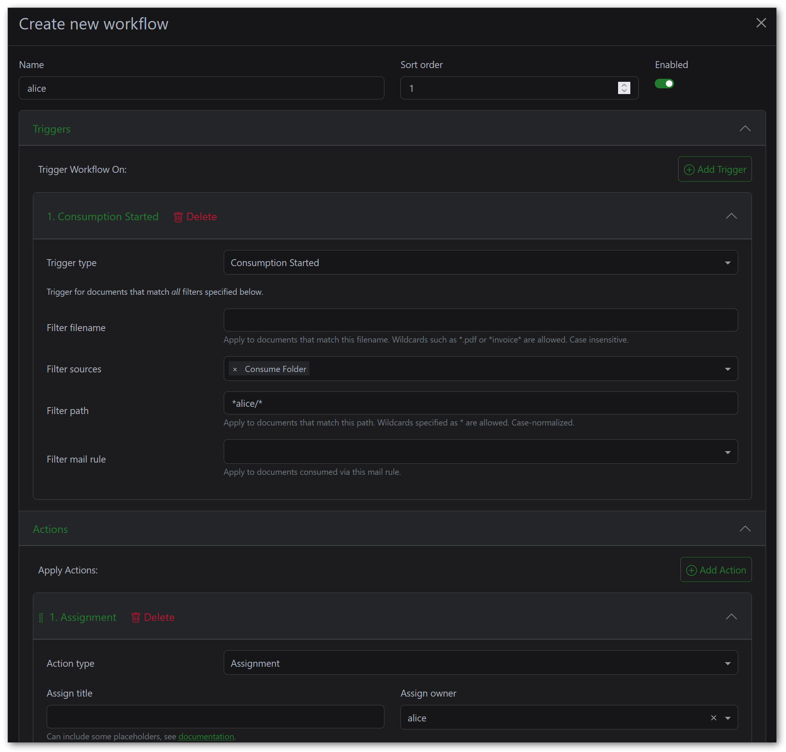

In this article, I walk through my experience setting up a self-hosted, multi-user document management system using `Paperless-ngx`. The goal was to build a pipeline where each household member can scan paper documents with a shared network scanner, and have them automatically ingested, OCR-processed, and filed under the correct user account.

## 1 Motivation

I have been accumulating paper documents for years - tax returns, insurance letters, invoices, contracts - and finding anything specific meant digging through a growing collection of binders and folders. Digitizing my document workflow had been on my to-do list for a long time, and I finally got around to looking into self-hosted solutions that I could run in my home lab.

After comparing a few options, I settled on `Paperless-ngx`. It does OCR, full-text search, and tagging, runs in Docker, and has a clean web UI that is actively maintained. On top of that, it nowadays supports multi-user setups out of the box, which I needed since my wife and I both have our own documents to manage. The only thing I still had to figure out was how to get documents into the system without manually uploading them - ideally by just feeding paper into a scanner and having everything happen automatically.

The setup I ended up with has two key requirements: multiple users need their own document space, and a shared `Brother ADS-4700W` network scanner needs to push scanned documents directly into the right user's inbox. In this article, I describe the entire process from preparing the Linux host through to configuring the scanner.

## 2 Architecture Overview

The system runs on a `Debian` virtual machine and consists of two Docker Compose stacks plus the network scanner:

- **Paperless-ngx stack** (`/srv/paperless/`)
  
  The main application with `Redis`, `PostgreSQL`, `Gotenberg`, and `Tika` as supporting services.
- **Samba stack** (`/srv/samba/`)
  
  Provides SMB file shares so the scanner (and users) can drop documents into per-user ingest folders.
- **Brother ADS-4700W**
  
  A dedicated document scanner with an automatic document feeder that pushes scans via SMB.


graph LR;
    A[Brother ADS-4700W] -->|SMB| B[Samba Container]
    B -->|Shared Volume| C[Ingest Folders]
    C -->|Consumer| D[Paperless-ngx]
    D --> E[PostgreSQL]
    D --> F[Media Storage]


The target directory structure on the host looks like this:

```text
/srv/
├── paperless/
│   ├── compose.yml
│   ├── data/
│   ├── export/
│   ├── media/
│   ├── postgres/
│   ├── redis/
│   └── inbox/
│       ├── alice/
│       └── bob/
└── samba/
    └── compose.yml
```

The `inbox` directory is the central piece connecting everything. Samba exposes it as a network share, and Paperless monitors it for new documents. Each user gets their own subfolder, and Paperless assigns document ownership based on which subfolder a file lands in.

## 3 Preparing the Host System

Before deploying any containers, we need to set up the Linux users, groups, and directory structure on the host. The idea is straightforward: a dedicated `paperless` system user (UID 10000) runs the Docker containers, and individual users (`alice` and `bob`) each own their ingest subfolder. All of them share a common `paperless` group (GID 10000), which is what ties the permissions together.

### 3.1 Setup Script

Rather than walking through each command individually, here is a script that handles the entire preparation. In short, the script does the following:

- Creates a `paperless` system group and user (UID/GID 10000) that will own the Docker containers and all persistent data directories.
- Creates individual system accounts for `alice` and `bob` with dedicated UIDs and adds them to the `paperless` group as a supplementary group.
- Builds the full directory tree under `/srv/` for both the Paperless and Samba stacks.
- Sets ownership and permissions on each directory, including the `setgid` bit on the per-user inbox folders so that new files always inherit the `paperless` group.


The `setgid` bit on the per-user inbox directories is critical. It ensures that any file created inside them inherits the `paperless` group. Without this, files dropped by `alice` or `bob` would get the user's primary group instead, and the Paperless consumer process would not be able to read them.


```shell
#!/usr/bin/env bash
set -euo pipefail

# ------------------------------------------------------------------
# Setup script for Paperless-ngx multi-user document management.
# ------------------------------------------------------------------

BASE_DIR=/srv
PAPERLESS_UID=10000
PAPERLESS_GID=10000
ALICE_UID=20000
BOB_UID=20001

# Create the paperless system group and user.
groupadd \
  --system \
  --gid "$PAPERLESS_GID" \
  paperless
useradd \
  --system \
  --uid "$PAPERLESS_UID" \
  --gid "$PAPERLESS_GID" \
  --no-create-home \
  --shell /usr/sbin/nologin \
  paperless

# Create alice and bob with paperless as supplementary group.
useradd \
  --system \
  --uid "$ALICE_UID" \
  --no-create-home \
  --shell /usr/sbin/nologin \
  --groups paperless \
  alice

useradd \
  --system \
  --uid "$BOB_UID" \
  --no-create-home \
  --shell /usr/sbin/nologin \
  --groups paperless \
  bob

# Create directory structure.
mkdir -p "$BASE_DIR/paperless"/{data,export,media,postgres,redis,inbox}
mkdir -p "$BASE_DIR/paperless/inbox"/{alice,bob}
mkdir -p "$BASE_DIR/samba"

# Set ownership for paperless directories.
chown -R paperless:paperless \
  "$BASE_DIR/paperless"/{data,export,media,postgres,redis}

# Set ownership and permissions for inbox.
chown root:paperless "$BASE_DIR/paperless/inbox"
chmod 775 "$BASE_DIR/paperless/inbox"

# Set ownership for per-user inbox directories with setgid.
chown alice:paperless "$BASE_DIR/paperless/inbox/alice"
chmod 2770 "$BASE_DIR/paperless/inbox/alice"

chown bob:paperless "$BASE_DIR/paperless/inbox/bob"
chmod 2770 "$BASE_DIR/paperless/inbox/bob"

echo "Setup complete."
```

### 3.2 Verifying the Setup

After running the script, verify that everything looks correct:

```shell
root@paperless:~# id paperless
uid=10000(paperless) gid=10000(paperless) groups=10000(paperless)

root@paperless:~# id alice
uid=20000(alice) gid=20000(alice) groups=20000(alice),10000(paperless)

root@paperless:~# id bob
uid=20001(bob) gid=20001(bob) groups=20001(bob),10000(paperless)

root@paperless:~# ls -la /srv/paperless/inbox/
total 16
drwxrwxr-x 4 root  paperless 4096 Feb 06 12:00 .
drwxr-xr-x 9 root  root      4096 Feb 06 12:00 ..
drwxrws--- 2 alice paperless 4096 Feb 06 12:00 alice
drwxrws--- 2 bob   paperless 4096 Feb 06 12:00 bob
```

\
The key things to confirm: the `paperless` group (GID 10000) is shared across all users, each inbox subfolder is owned by its respective user, and the `s` in the group permission column indicates the `setgid` bit is set.

## 4 Deploying Paperless-ngx

The `Paperless-ngx` stack lives at `/srv/paperless/compose.yml` and consists of five services: `Redis` as the message broker, `PostgreSQL` as the database, the `Paperless-ngx` webserver itself, `Gotenberg` for document conversion, and `Tika` for content extraction. All services run under UID/GID 10000 to match the `paperless` host user.

### 4.1 Docker Compose Configuration

```yaml
name: paperless

services:
  broker:
    container_name: paperless-broker
    image: docker.io/library/redis:8
    restart: unless-stopped
    user: 10000:10000
    networks:
      paperless:
        aliases:
          - broker
    volumes:
      - /etc/timezone:/etc/timezone:ro
      - /etc/localtime:/etc/localtime:ro
      - ./redis:/data

  db:
    container_name: paperless-db
    image: docker.io/library/postgres:18
    restart: unless-stopped
    user: 10000:10000
    networks:
      paperless:
        aliases:
          - db
    volumes:
      - /etc/timezone:/etc/timezone:ro
      - /etc/localtime:/etc/localtime:ro
      - ./postgres:/var/lib/postgresql
    environment:
      POSTGRES_DB: paperless
      POSTGRES_USER: paperless
      POSTGRES_PASSWORD: paperless

  webserver:
    container_name: paperless-webserver
    image: ghcr.io/paperless-ngx/paperless-ngx:latest
    restart: unless-stopped
    user: 10000:10000
    depends_on:
      - db
      - broker
      - gotenberg
      - tika
    networks:
      paperless:
        aliases:
          - paperless
    ports:
      - "8000:8000"
    volumes:
      - /etc/timezone:/etc/timezone:ro
      - /etc/localtime:/etc/localtime:ro
      - ./data:/usr/src/paperless/data
      - ./media:/usr/src/paperless/media
      - ./export:/usr/src/paperless/export
      - ./inbox:/usr/src/paperless/consume
    environment:
      PAPERLESS_REDIS: redis://broker:6379
      PAPERLESS_DBHOST: db
      PAPERLESS_TIKA_ENABLED: 1
      PAPERLESS_TIKA_GOTENBERG_ENDPOINT: http://gotenberg:3000
      PAPERLESS_TIKA_ENDPOINT: http://tika:9998
      # PAPERLESS_URL: https://paperless.example.com
      # PAPERLESS_SECRET_KEY: change-me
      PAPERLESS_TASK_WORKERS: 4
      PAPERLESS_CONSUMER_RECURSIVE: 1
      PAPERLESS_OCR_LANGUAGE: deu
      PAPERLESS_FILENAME_FORMAT: >-
        {{ owner_username }}/{{ created_year }}/{{ title }}

  gotenberg:
    container_name: paperless-gotenberg
    image: docker.io/gotenberg/gotenberg:8.25
    restart: unless-stopped
    user: 10000:10000
    command:
      - "gotenberg"
      - "--chromium-disable-javascript=true"
      - "--chromium-allow-list=file:///tmp/.*"
    networks:
      paperless:
        aliases:
          - gotenberg
    volumes:
      - /etc/timezone:/etc/timezone:ro
      - /etc/localtime:/etc/localtime:ro

  tika:
    container_name: paperless-tika
    image: docker.io/apache/tika:latest
    restart: unless-stopped
    user: 10000:10000
    networks:
      paperless:
        aliases:
          - tika
    volumes:
      - /etc/timezone:/etc/timezone:ro
      - /etc/localtime:/etc/localtime:ro

networks:
  paperless:
    name: paperless
```

\
A few things worth pointing out:

- `PAPERLESS_CONSUMER_RECURSIVE: 1` tells Paperless to watch subdirectories inside the consume folder. This is what makes the per-user inbox structure work - without it, files in `inbox/alice/` and `inbox/bob/` would simply be ignored.
- `PAPERLESS_OCR_LANGUAGE: deu` configures OCR for German documents. Adjust this to your language or use `eng` for English. Multiple languages can be specified as `deu+eng`.
- `PAPERLESS_FILENAME_FORMAT` uses the `owner_username` variable to organize stored files into per-user directories. The resulting file structure in the media directory looks like `alice/2026/Invoice Electricity.pdf`.
- `PAPERLESS_URL` and `PAPERLESS_SECRET_KEY` are commented out here. You should set these if you plan to expose Paperless beyond your local network (e.g. using a HTTPS proxy).


Make sure the UID and GID in the `user:` directive match the `paperless` host user (10000:10000). A mismatch will cause permission errors when the consumer tries to read files from the ingest folders or when the database and broker try to access their data directories.



The `./inbox` directory is mounted to `/usr/src/paperless/consume` inside the container. Combined with `PAPERLESS_CONSUMER_RECURSIVE: 1`, Paperless monitors all subdirectories - which is how it discovers documents in the per-user folders `alice/` and `bob/`.


### 4.2 Starting the Stack

Bring up the stack from the `/srv/paperless/` directory:

```shell
docker compose up -d
```

\
Wait a moment for the initial database migration to complete, then check the logs to make sure everything started up correctly:

```shell
docker compose logs -f webserver
```

\
Once you see a message like `Listening at: http://0.0.0.0:8000`, the webserver is ready.

## 5 Configuring Paperless-ngx

With the stack running, there are a few things to configure through the web UI that cannot be done through environment variables alone.

### 5.1 Creating Users

Open `http://<server-ip>:8000` in your browser. On first access, `Paperless-ngx` presents a setup wizard that prompts you to create the initial administrator account. Walk through this to set up your superuser.

After logging in as admin, navigate to the user management section (**Users & Groups**) and create a group to allow for easier permission management:



Afterwards, create two regular user accounts: `alice` and `bob`.



### 5.2 Configuring the Consumption Workflow

`Paperless-ngx` has a workflow feature that allows you to automatically process documents based on various triggers. I use this to assign document ownership based on the consume subfolder path. You need one workflow per user.

To create a workflow, navigate to the sidebar and click on **Workflows**, then click the **Create** button.



**Workflow 1 - "Assign Owner - Alice":**

- **Name:** `Assign Owner - Alice`
- **Trigger:**
  - Type: `Consumption Started`
  - Sources: `Consume Folder`
  - File Path: `*alice/*`
- **Action:**
  - Type: `Assignment`
  - Owner: `alice`

**Workflow 2 - "Assign Owner - Bob":**

- **Name:** `Assign Owner - Bob`
- **Trigger:**
  - Type: `Consumption Started`
  - Sources: `Consume Folder`
  - File Path: `*bob/*`
- **Action:**
  - Type: `Assignment`
  - Owner: `bob`

The file path pattern `*alice/*` matches any file consumed from a path containing `alice/` - which covers `/usr/src/paperless/consume/alice/document.pdf` inside the container. There is no way to dynamically extract the subfolder name and map it to a user in a single workflow, so you need to repeat this for each user.

## 6 Testing the Pipeline

Before wiring up Samba and the scanner, it is a good idea to do a quick manual test to verify that the consumer, OCR, and owner assignment all work correctly. Drop a test PDF into one of the inbox subfolders on the host:

```shell
cp test-document.pdf /srv/paperless/inbox/alice/
```

\
After a few seconds, Paperless should pick up the file, process it, and it will appear in the web UI. Log in as `alice` and verify that the document shows up under her account with the correct ownership. Repeat the test with Bob's folder to confirm both workflows are functioning.


Keep an eye on the Paperless logs during testing. If something goes wrong with permissions or the consumption workflow, the error messages are usually quite descriptive. You can watch them with `docker compose logs -f webserver` from the `/srv/paperless/` directory or in the UI (using the superuser account).


## 7 Setting Up Samba

With Paperless consuming documents correctly, the next step is to make the ingest folders accessible over the network. The `Brother ADS-4700W` scanner supports SMB as a push target, and Samba also lets users manually drop files into their inbox from any device on the local network.

### 7.1 Docker Compose Configuration

The Samba stack runs as a separate Docker Compose project at `/srv/samba/compose.yml` using the `ghcr.io/servercontainers/samba` image. This image is configured entirely through environment variables.

```yaml
name: samba

services:
  samba:
    container_name: samba
    image: ghcr.io/servercontainers/samba
    restart: unless-stopped
    networks:
      - samba
    ports:
      - "445:445"
    volumes:
      - /etc/timezone:/etc/timezone:ro
      - /etc/localtime:/etc/localtime:ro
      - ../paperless/inbox:/shares/inbox
    environment:
      AVAHI_DISABLE: 1
      WSDD2_DISABLE: 1
      NETBIOS_DISABLE: 1
      DISABLE_FRUIT_DEFAULTS: 1
      FAIL_FAST: 1
      SAMBA_CONF_LOG_LEVEL: 3

      GROUP_paperless: 10000

      ACCOUNT_alice: alicepass
      UID_alice: 20000
      GROUPS_alice: paperless

      ACCOUNT_bob: bobpass
      UID_bob: 20001
      GROUPS_bob: paperless

      SAMBA_VOLUME_CONFIG_inbox: |
        [inbox]
        path=/shares/inbox/%U
        valid users = alice, bob
        guest ok = no
        read only = no
        browseable = yes

networks:
  samba:
    name: samba
```

\
A few key points about this configuration:

- The `GROUP_paperless: 10000` entry creates a `paperless` group inside the container with GID 10000, matching the host group. Similarly, `UID_alice: 20000` and `UID_bob: 20001` match the host UIDs. This is essential for file permissions to work correctly across the container boundary.
- The `ACCOUNT_alice` and `ACCOUNT_bob` entries set the Samba passwords for each user. In a production setup, you would want to use hashed passwords instead of plaintext.
- The volume mount `../paperless/inbox:/shares/inbox` maps the Paperless ingest directory into the Samba container. Since both compose files are in sibling directories under `/srv/`, the relative path `../paperless/inbox` resolves to `/srv/paperless/inbox`.


The `%U` variable in the Samba share path is replaced with the authenticated username at connection time. When `alice` connects to the `inbox` share, Samba routes her to `/shares/inbox/alice`. When `bob` connects, he ends up in `/shares/inbox/bob`. Each user only sees their own folder.



The `servercontainers/samba` image also accepts hashed passwords in `smbpasswd` format instead of plaintext. The image ships with a helper script to generate them:

```shell
docker run -ti --rm \
  --entrypoint create-hash.sh \
  ghcr.io/servercontainers/samba
```

The script outputs a full `smbpasswd`-style line like `user:UID:LM_HASH:NT_HASH:[U ]:LCT-TIMESTAMP:`. Use that entire string as the `ACCOUNT_<user>` value in place of the plaintext password. Note that usernames must be lowercase when using this script.


### 7.2 Starting and Testing Samba

Start the Samba stack from the `/srv/samba/` directory:

```shell
docker compose up -d
```

\
To verify the share is accessible, test it from another machine on the network. On Linux, you can use `smbclient`:

```shell
smbclient //<server-address>/inbox -U alice
```

\
After entering the password, you should be dropped into a Samba shell where you can list files and upload a test document. On Windows, open File Explorer and navigate to `\\<server-address>\inbox`, then enter the credentials when prompted.

Any file dropped into the share at this point should appear in the Paperless web UI after a few seconds, automatically assigned to the correct user.

## 8 Configuring the Scanner

With Samba in place, the last thing to set up is the `Brother ADS-4700W` network scanner itself. This is a dedicated document scanner with a 100-page automatic document feeder and a touchscreen, making it well suited for batch scanning. It can push scanned documents directly to an SMB share, so all we need to do is point it at the right target.

### 8.1 Accessing the Web Interface

The scanner is configured through its web-based management interface. Find the scanner's IP address by checking the touchscreen under **Settings** > **Network** > **Wired LAN** > **TCP/IP**, or look it up in your router's DHCP lease table. Then open `https://<scanner-ip>` in your browser and log in with the administrator password. The default password is printed on a label on the back of the scanner.

### 8.2 Creating Scan Profiles

In the web interface, navigate to **Scan** > **Scan to FTP/SFTP/Network/SharePoint**. Select the **Network** radio button and click **Submit**. Then click **Scan to FTP/SFTP/Network Profile** in the navigation menu to see the list of available profile slots.

Click on an empty profile slot to configure it. I created one profile per user so that Alice and Bob each have their own scan target. Here is an example configuration for Alice (only relevant settings):

| **Field**              | **Value**                            |
| ---------------------- | ------------------------------------ |
| **Profile Name**       | `Alice`                              |
| **Network Folder Path**| `\\<paperless-server-address>\inbox` |
| **Auth Method**        | `NTLMv2`                             |
| **Username**           | `alice`                              |
| **Password**           | Alice's Samba password               |

Create a second profile for Bob with his credentials. The network folder path is exactly the same, because the `%U` variable in the Samba configuration automatically routes each user to their own subfolder based on the authenticated username.


Make sure the scanner's clock is synchronized with the network. SMB authentication can fail if there is too much time drift between the scanner and the server. Configure the SNTP server under **Network** > **Protocol** > **SNTP** in the scanner's web interface, or set the time manually on the touchscreen.


### 8.3 Creating One-Touch Shortcuts

The `Brother ADS-4700W` supports one-touch shortcuts on its home screen, which means each user can have a dedicated icon that starts a scan with their profile in a single tap. When saving a profile, the scanner offers to create a shortcut automatically. I recommend doing this for each user profile.

## 9 Conclusion

The whole setup works exactly as I had hoped. A user places documents in the scanner, taps their shortcut, and the scanned PDF flows through Samba into the per-user ingest folder, where Paperless picks it up, runs OCR, and assigns the correct ownership.

A few key takeaways from this setup: getting the UIDs and GIDs right between the Docker containers and the host is essential. If they do not match, you will run into permission errors that can be frustrating to debug. The `setgid` bit on the per-user inbox directories is a small but important detail that makes the shared group access work reliably. And the `%U` variable in the Samba share path is an elegant way to route users to their own folders without needing separate share definitions.

## 10 Next Steps

### 10.1 Automating User Management

Adding more users to this setup is conceptually simple, but in practice it is a good chunk of manual work. You need to create a system user on the host, add an inbox subfolder with the right ownership and permissions, add a Samba account with matching UID, create a Paperless user and a corresponding consumption workflow, and finally configure a scanner profile. That is five or six places to touch for every new user - and just as many to clean up when removing one.

If I find the time, I would like to build a small automation service that hooks into the Paperless user management. The idea is that whenever a user is created or removed in the Paperless web UI, the service automatically provisions or deprovisions the matching system user, Samba account, inbox folder, and consumption workflow. That would reduce the entire onboarding process to a single step in the Paperless admin panel and remove the risk of forgetting one of the manual steps along the way.

### 10.2 AI-Powered Document Processing

There are two community projects that extend `Paperless-ngx` with AI capabilities: `paperless-gpt` and `paperless-ai`. Both can be used side by side.

`paperless-gpt` connects to an LLM (local or cloud-hosted) and re-processes the OCR output of ingested documents. In my experience, this resulted in a huge accuracy boost for documents that are difficult to read like handwritten notes that the built-in Tesseract OCR struggled with.

On top of the improved OCR, it also offers automated tagging, correspondent detection, and document type classification. These also work very well, as long as the underlying OCR quality is decent.

`paperless-ai` does not support AI assisted OCR, but it also provides automated tagging, correspondent detection, and document type classification and most notably a RAG-style chat feature that lets you ask questions about your documents in natural language.

There is one significant caveat with both tools in a multi-user setup, though. Both use a single shared (e.g. superuser) API token to interact with the Paperless API, which means all edits happen on behalf of one user. This leads to two suboptimal scenarios for any entities (tags, correspondents, document types) that the AI creates:

- The entities end up with no owner (default owner and permissions for newly created entities can be configured in the UI) and are visible to all users. In a household this might be acceptable, but in more privacy-conscious setups it is not.
- The entities belong to a single user (e.g. the token owner) and cannot be read by the actual owner of the document.

One workaround to use in a privacy-conscious setup is to run a separate instance of `paperless-gpt` or `paperless-ai` per user, each configured with its own API token.

The downside is that shared tags and correspondents end up duplicated - once per user - which complicates search and filtering, if documents are shared between the users. In the end, it's a tradeoff between privacy and ease of use.
