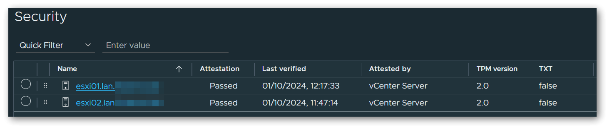
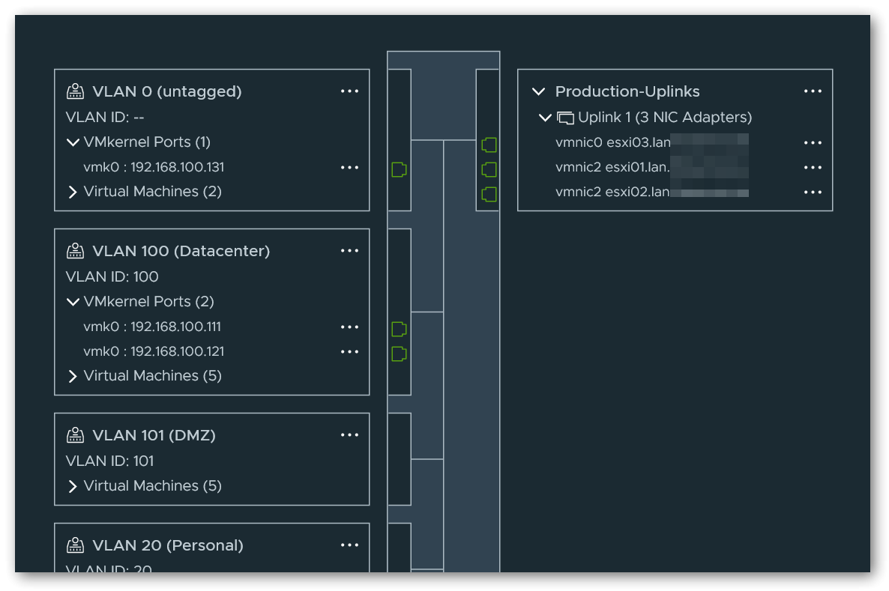
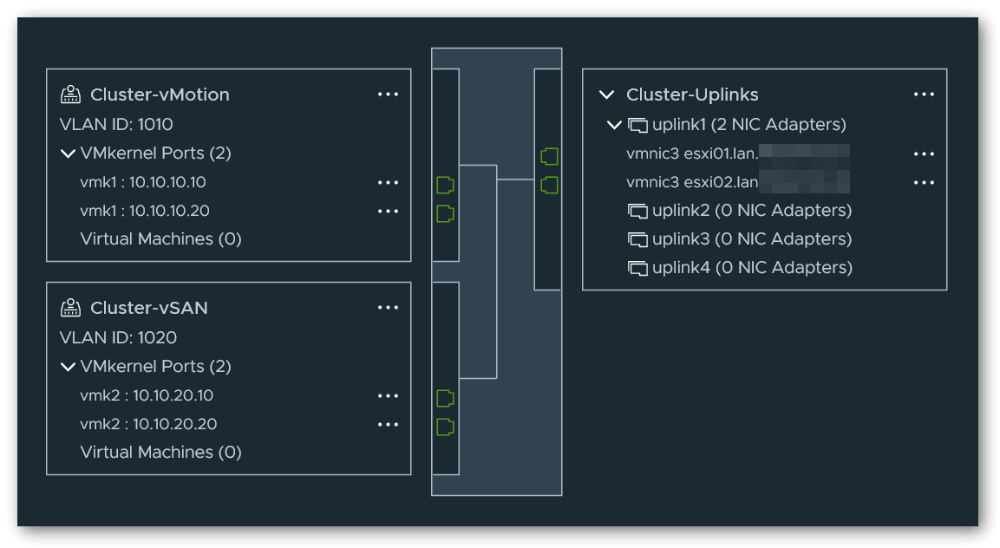
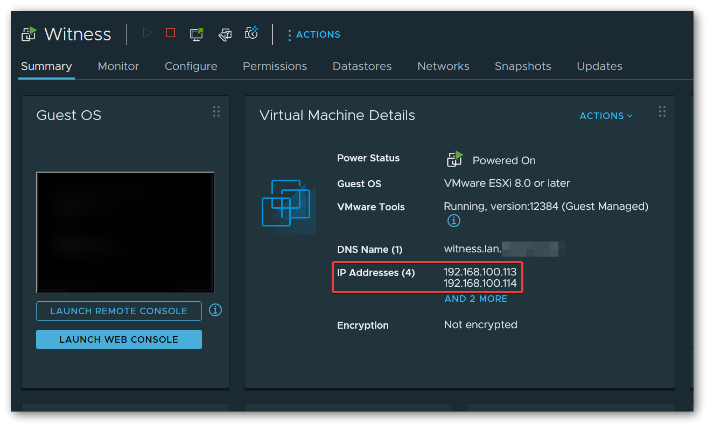
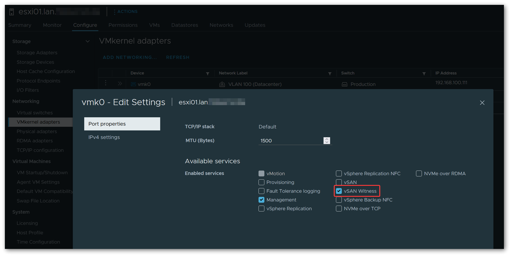

## Introduction

I have been using VMware ESXi as a hypervisor for my virtual machines in my home lab for some time now. In addition to various VMs, which are used for development purposes, I host various internal and external services.

A few months ago, the time had finally come for me to take the next step. I decided to convert my single ESXi (7) host into a 2-node cluster and to use the new vSAN ESA in order to be able to use all vSphere HA features.

The sense or nonsense of high availability in a home lab is certainly debatable, but in the end it pays off enormously, especially for internal network services such as my virtualized pfSense firewall/router. For example, HA allows me to perform updates on one of the ESXi hosts without interrupting the internal network traffic.

This blog post is primarily aimed at Homelab users and therefore deals mainly with the hardware. There are already numerous other articles on setting up vSphere 2-node clusters in general.

## Hardware

A primary requirement when selecting the hardware was energy efficiency in idle or normal operation. In addition, the components should not be overly expensive and the CPU should offer a good balance between core count and single core clock rate (some of my specific workloads benefit enormously from high clock rates). Since vSAN ESA is particularly picky when it comes to using non-certified components, this factor also had to be taken into account.

In the end, I decided on the W680 consumer platform, which offers support for 14th generation Intel CPUs and up to 128 GiB DDR5 ECC RAM. The only disadvantage - which all Intel consumer platforms have - is the rather small number of PCIe lanes.

### Case

The case of my choice is the rack mountable **Inter-Tech 4U-40248, 4U**. This has enough space for an ATX mainboard and ATX power supply and also offers the option of installing a tall CPU cooler and 2x 120mm fans. There are also numerous slots for HDDs/SSDs behind the fan mounts, two of which I use to mount the 2.5" vSAN SSDs.

### Mainboard

The mainboard chosen was the **ASUS Pro WS W680-Ace IPMI**, which enables fully autonomous remote management via the IPMI card using the iKVM web interface. The board offers 3x M.2 SSD slots which are connected via PCIe 4.0 x4, as well as 2 PCIe 5.0 x16 slots, which unfortunately share the lanes. In this respect, either one of the slots can be operated with 16 lanes, or both slots with 8 lanes simultaneously. There are also 2 PCIe 3.0 x8 slots, both of which only provide 4 electrical lanes, and a single PCIe 3.0 x1 slot, which is reserved for the IPMI expansion card.

In order for the attestation of the ESXi hosts in vSphere to be successful later, a physical TPM 2.0 module is also required, which I purchased separately. ASUS itself offers the **ASUS TPM-SPI Module**, which is fully compatible with the mainboard and also supports the `TIS/FIFO` interface required by ESXi. Many TPM modules still work exclusively with the `CRB` interface, which cannot be used by ESXi.

> **Note**
>
> If the `TIS/FIFO` interface is not activated correctly, a complete CMOS reset (via mainboard jumper) must first be performed after flashing the latest BIOS and the current ME firmware. After this, the TPM was immediately recognized and used correctly on both machines.

Unfortunately, the in-band IPMI interface is not recognized correctly by ESXi and therefore no hardware sensors are displayed in the ESXi control panel or in the vSphere Client. The `AST2600` chip is actually on the HCL, but there still seems to be a problem with the integration somewhere. However, as I can live with this, I have not yet carried out any further debugging.

### CPU

The CPU used is the **Intel Core i7-14700K**, which contains 8 performance cores (base: 3.4GHz, boost: 5.6GHz) and 12 efficiency cores (base: 2.5GHz, boost: 4.3GHz).

> **Note**
>
>  Since ESXi is designed for server hardware and the non-uniform cores of the Raptor Lake (Refresh) architecture cause problems here, the efficiency cores must be deactivated in the BIOS before installing the hypervisor OS. Alternatively, the check for uniform CPU cores, which takes place during booting, can also be deactivated, but the scheduler still does not know the concept of P-cores and E-cores, which is why it often leads to unfavorable distribution of workloads. More about this: [here](https://williamlam.com/2023/04/esxi-psod-due-to-gp-exception-13-in-world-with-intel-13th-generation-cpu.html).

### RAM

For the RAM, I opted for 4 bars of **Kingston Server Premier DIMM 32GB, DDR5-5600, CL46-45-45, ECC, on-die ECC** ([KSM56E46BD8KM-32HA](https://www.kingston.com/datasheets/KSM56E46BD8KM-32HA.pdf)) for a total capacity of 128 GiB. These modules are currently not on the QVL, but are working perfectly. If it is important to you to only use QVL listed RAM, you could also use the model [KSM48E40BD8KM-32HM](https://www.kingston.com/datasheets/KSM48E40BD8KM-32HM.pdf) with CL40-39-39 @ 4800MHz as an alternative.

> **Note**
>
> The RAM does not have an XMP profile, which is why voltages and timings must be configured manually in the BIOS. However, this is not a major problem thanks to the provided data sheet.

### SAN Storage

As primary vSAN storage I use 2x **Solidigm SSD D7-P5520 1.92TB, U.2** per host, which are connected to the onboard M.2 connectors via M.2 to U.2 adapter cable. These SSDs are qualified for vSAN ESA according to VMware HCL and are indeed correctly listed as "supported" in the vSphere control center.

The adapter cable used here is the **Delock M.2 Key M to U.2 SFF-8639 NVMe Adapter**.

### OS Storage

Since the mainboard has a total of 3 M.2 ports and I only use 2 of them for the vSAN SSDs, a **Samsung SSD 980 PRO 500GB, M.2** is used as storage for the operating system for the sake of simplicity. Alternatively, you could also use a SATA DOM here, but in my case at least, these were far less available and also a little more expensive than the simple Samsung SSD.

### Network

In addition to the two onboard 2.5G ethernet ports, I have installed an **NVIDIA Mellanox ConnectX-5 EN 25G** NIC, which has 2 ports that can be operated in 25G mode via SFP28 module, or in 10G mode via SFP+ module. This card requires a connection via PCIe 3.0 x8, which means that we have to use one of the PCIe 5.0 slots on the mainboard for full bandwidth (both PCIe 3.0 x8 slots on the mainboard are only connected with x4 electrical lanes). 

### Power Supply

The power supply is a **Seasonic Prime PX-750 750W ATX 2.4**, which has a very high efficiency thanks to "Platinum" certification and offers more than sufficient power at 750W.

### Cooler

As CPU cooler I use the **Alpenföhn Brocken 4**, which, when installed, is flush with the lid of the case down to the last millimeter. There are mounting slots on the heat sink for up to 2x 120mm fans, on which I have installed two **Arctic P12 Max** fans instead of the included fan. More about these in the next section.

### FANs

In addition to the two fans on the CPU cooler, another 2x **Arctic P8 Max** and 2x **Arctic P12 Max** PWM fans are used, for which I have replaced the pre-assembled models in the case. These fans are very quiet at low speeds, but can also generate a lot of static pressure if necessary. If desired, a 0-RPM mode is also available.

## Firmware

### Update

TBD

### BIOS Settings

TBD

## Software

When setting up the cluster, I used the following blog post as a basis:
https://blog.yahyazahedi.com/2023/07/21/configure-2-node-vsan-cluster-esa/

### Distributed Switches

In the linked article, the author uses 2 dedicated NIC ports with failover for each of the networks `Management`, `Production`, `vMotion` and `vSAN`. Since the network card I chose only has 2 ports in total, I adjusted the network configuration as follows:

For `Management` and `Production`, I created a distributed switch that uses port 1 as an uplink and is connected directly to a physical switch via this port. Both the management network and the individual segments of my production network are separated by VLANs.

*Management network is called `Datacenter` in the above configuration.*

For `vMotion` and `vSAN`, I have created another distributed switch that uses port 2 as an uplink and connected it to the other node via a DAC cable. Again, I have isolated the networks using a VLAN tag on the corresponding port groups.

> **Note**
>
> It is important to initially configure 4 virtual uplinks for the `vMotion`/`vSAN` switch so that the pre-configured switch is later correctly presented for selection in the cluster setup wizard. However, it is sufficient if only one of the uplinks is assigned a NIC port. Once the cluster has been completely set up, the additional virtual uplink can optionally be removed without any problems.

### Witness Traffic Separation

A small adjustment must also be made when configuring the Witness Appliance. Due to the direct connection of the two nodes, the `vSAN` network is locally isolated and no data traffic can flow from/to the vSAN Witness Appliance. The "Witness Traffic Separation (WTS)" concept can be used to solve this problem. For this purpose, I have set both the `Management Network` and the `Secondary Network` (usually `vSAN`) to the management network port group of the 1st distributed switch when deploying the Witness Appliance. 

In the VMkernel adapters of both nodes, `vSAN Witness` must now also be activated under `Enabled services` of the management network adapter (usually `vmk0`).

This configuration allows regular `vSAN` traffic to flow directly between the nodes via the 2nd distributed switch, while `vSAN Witness` traffic uses the 1st distributed switch and the management network connected to it. Instead of using the management network, an additional network segment/VLAN and an additional VMKernel adapter could have been used for this, but I decided not to do this for the sake of simplicity.